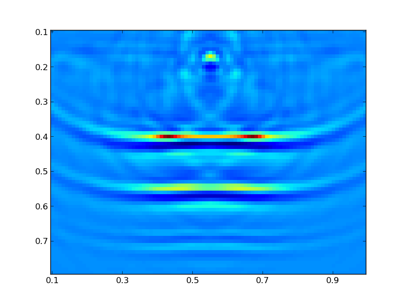

.. Licensed under a 3-clause BSD style license - see LICENSE.rst

.. _quick_start_example:

.. note::

    The problem in this example is small enough that it can be run in serial
    on a normal laptop in (at worst) a few minutes.  For a more complex
    example that should run in parallel, see
    :ref:`quick_start_example_marmousi`.

This example is a quick guide to the general structure of a PySIT seismic
inversion script.   You can either type the commands into the IPython console,
or you can copy sections in by copying the text and using the ``%paste``
`IPython magic function
<http://ipython.org/ipython-doc/dev/interactive/tutorial.html#magic-functions>`_.

2D Horizontal Reflectors
========================

The source code for a slightly more complex version of this example is found in the
PySIT examples directory: `examples/HorizontalReflector2D.py`.

Set Up the Computing Environment
--------------------------------

To get started, start an IPython console with the command

.. code::

    ipython --pylab

First, we must import some fairly standard python and numerical python
libraries that we will use in this demo. Run the following commands:

.. code:: python

    import numpy as np
    import matplotlib.pyplot as plt

to import the numpy module, which contains the basic numerical array
functionality (we have chosen to abbreviate it with the standard shorthand
np), and the matplotlib plotting library which we also abbreviate as is the
standard.

Next, import all of the basic functionality of the pysit module:

.. code:: python

    from pysit import *

This will give access to almost everything we need. However, the gallery
examples are not imported with the previous statement, so we must import the
horizontal_reflector module separately:

.. code:: python

    from pysit.gallery import horizontal_reflector

Set Up the Model Problem
------------------------

PySIT is designed to model the physical observation geometry in as intuitively
as possible. Generally the first thing that needs to be done is to define a
physical and computational domain in which to work:

.. code:: python

    pmlx = PML(0.1, 100)
    pmlz = PML(0.1, 100)

    x_config = (0.1, 1.0, pmlx, pmlx)
    z_config = (0.1, 0.8, pmlz, pmlz)

These lines define the x and z boundaries of the domain in physical
coordinates (arbitrary units for this example) and the boundary conditions on
the left and right sides of each dimension.  PySIT works in the typical left
handed coordinate system of geophysics (Z points down).

Currently, the PySIT supports Dirichlet boundaries and absorbing boundaries
implemented using a perfectly matched layer (PML), which is defined using the `PML`
class. The PML is specified in the same physical units as the
domain. Here, we have defined the PML to have length 1/10 units, in each
direction, with a PML intensity parameter of 100. Finally, we can define the
domain itself:

.. code:: python

    domain = RectangularDomain(x_config, z_config)

PySIT works for 1D, 2D, and 3D problems. We have chosen a 2D example. The
argument list to the domain constructor is a configuration tuple for each
dimension. The constructor uses the number of these configurations to
determine the dimension of the problem.  Most procedural gallery problems
require you to create a physical domain, most community/precomputed gallery
problems generate domains and meshes for you.

After the physical domain is specified, we must specify a computational domain
or a mesh:

.. code:: python

    mesh = CartesianMesh(d, 91, 71)

The Cartesian mesh takes a domain as its first parameter, and then the number
of grid points in each dimension as the remaining arguments.  Note that both
end points are included, so this will ensure that the grid spacing is 0.01.

Finally, create the reflection model:

.. code:: python

    C, C0, mesh, domain = horizontal_reflector(mesh)

.. note::

    `horizontal_reflector` is a convenience function for generating problem
    setups.  All of these convenience functions have the same return
    signature, a tuple containing:

    1. the true model,
    2. an initial model,
    3. the computational mesh,
    4. the computational domain.

    This means that, occasionally, some variables are passed in and returned
    by the function.  Some gallery examples (e.g., Marmousi) generate the
    domain and mesh as well, but we must create one to use the horizontal
    reflector gallery model.

Here, we have acoustic model parameters defined such that C^-2 = C0^-2 + dM.
Thus, C is the true wave speed, C0 is the initial non-oscillatory model, and
dM, which is not returned, is the perturbation of the model. The model problem
can be plotted by:

.. code:: python

    plt.figure()
    vis.plot(C, mesh)
    plt.draw()

The plot command used is part of the visualization tools provided by PySIT.
The result should be a figure that looks like this:

.. image:: ../_static/ex_reflector.png
   :width: 75%

Set Up the Sources and Receivers
--------------------------------

For this example, we will use a single shot. A shot is a source coupled with a
receiver or a group of receivers. Before going on, let us extract some useful
information:

.. code:: python

    zmin = d.z.lbound
    zmax = d.z.rbound
    zpos = zmin + (1./9.)*zmax

zmin and zmax are the left and right (or top and bottom) physical boundaries
of the domain. Alternatively, we could hard code these from the specification
above, but this is a good time to introduce a useful property of the domain:
The spatial properties of the domain are typically described without the
boundary/ghost conditions.

In this example, d.z.lbound (the *top* physical coordinate) has the value 0.1
and d.z.lbc.length (the *physical size* of the top PML) has the value 0.1.
Thus, the effective domain has a top boundary of 0.0 when boundary conditions
are included.  The boundary conditions only come into play during the wave
propagation phases.

For testing, a common acquisition regime is the equispaced acquisition, where
sources and receivers are even spaced across the domain at a fixed depth.
PySIT provides a convenience routine for creating one
(`equispaced_acquisition`):

.. code:: python

    shots = equispaced_acquisition(mesh,
                                   RickerWavelet(10.0),
                                   sources=1,
                                   source_depth=zpos,
                                   receivers='max',
                                   receiver_depth=zpos)

For this case, we have chosen one to use one source, at the previous specified
depth (which is the 'top' of the domain and not in the PML region) and the
maximum number of receivers (the number of horizontal grid points) at the same
depth. Because we chose equispaced sources, the single source is in the middle
of the domain. The source function itself is a Ricker wavelet with peak
frequency of 10Hz. The return value, ``shots`` is a list of `Shot` objects.
Each `Shot` object contains a source-receiver pair (or a
`PointSource`-`ReceiverSet` pair, to be more specific).  The portions of PySIT
that deal with shots, expect collections of shots to be in a Python list.

Define the Solver and Generate Synthetic Data
---------------------------------------------

PySIT defines solvers as objects that are passed to different routines. This
is so that all code that uses wave solvers remains generic. Any PySIT solver
object can be used here, but we will use a solver for the constant-density
acoustic wave equation, `ConstantDensityAcousticWave`. The factory for
`ConstantDensityAcousticWave` automatically determines the correct dimension
for the solver based on the mesh that is provided.

.. code:: python

    solver = ConstantDensityAcousticWave(mesh,
                                         formulation='scalar',
                                         spatial_accuracy_order=2,
                                         trange=(0.0, 3.0),
                                         kernel_implementation='cpp')

The first argument is, again, the mesh, the second specifies that we are using
the scalar form of the equation, and the third specifies the set of wave
parameters that are to be used in the solve. Finally, we specify the time
range (in seconds), the spatial accuracy, and to use an accelerated solver.

This solver is then used to generate some seismic data:

.. code:: python

    wavefields = []
    base_model = solver.ModelParameters(mesh, {'C': C})
    generate_seismic_data(shots,
                          solver,
                          base_model,
                          wavefields=wavefields)

We pass the list of shots and the solver we chose to the data generation
routine. The first line generates an empty list that will be passed as an
argument to the data generation routine. This tells the routine to extract the
wave evolution in the list ``wavefields``, which can be viewed with the
PySIT animation function `vis.animate`:

.. code:: python

    vis.animate(wavefields, mesh, display_rate=10)

After the routine has run, each receiver will have its trace stored
internally.

Objective Function and Solving the Inverse Problem
--------------------------------------------------

To solve an inversion problem in PySIT, you must specify an objective function
and an algorithm for optimizing it. PySIT currently defines the least-squares
objective in the time and frequency domains, as well as a hybrid approach.
Objective functions require wave equation modeling, and thus are dependent
upon our solver. Here, we define the time-domain objective:

.. code:: python

    objective = TemporalLeastSquares(solver)

PySIT defines inversion methods as stateful objects. Currently, PySIT supports
gradient descent, L-BFGS, and more.  L-BFGS is the preferred method:

.. code:: python

    invalg = LBFGS(objective)

The inversion algorithm requires the objective function of choice to be
specified as an argument. Additionally, we need an initial value, so define
that as well:

.. code:: python

    initial_value = solver.ModelParameters(mesh, {'C': C0})

Next, we must configure the optimization routine's diagnostic recording. Each
of the following dictionary entries specify the frequency (in iterations) with
which the listed value is stored:

.. code:: python

    status_configuration = {'value_frequency': 1,
                            'residual_frequency': 1,
                            'residual_length_frequency': 1,
                            'objective_frequency': 1,
                            'step_frequency': 1,
                            'step_length_frequency': 1,
                            'gradient_frequency': 1,
                            'gradient_length_frequency': 1,
                            'run_time_frequency': 1,
                            'alpha_frequency': 1}

Finally, we can run the optimization routine:

.. code:: python

    nsteps = 15
    result = invalg(shots,
                    initial_value,
                    nsteps,
                    line_search='backtrack',
                    status_configuration=status_configuration,
                    verbose=True)

This will run 15 iterations of L-BFGS starting from initial_guess using a
backtracking line search. There are other optional arguments (that can be seen
in the documentation) that allow for extraction of intermediate values and
tracking of things like the residual history.

Finally, we can plot the resulting model:

.. code:: python

    plt.figure()
    vis.plot(result.C, m)
    plt.draw()

Where you should see a figure that looks like this:

Additionally, you can look at the descent behavior of the algorithm by
plotting the objective values:

.. code:: python

    obj_vals = np.array([v for k,v in invalg.objective_history.items()])
    plt.figure()
    plt.semilogy(obj_vals)

Or you can look compare the true, initial, and final solutions:

.. code:: python

    clim = C.min(),C.max()
    plt.figure()
    plt.subplot(3,1,1)
    vis.plot(C0, m, clim=clim)
    plt.title('Initial Model')
    plt.subplot(3,1,2)
    vis.plot(C, m, clim=clim)
    plt.title('True Model')
    plt.subplot(3,1,3)
    vis.plot(result.C, m, clim=clim)
    plt.title('Reconstruction')
    plt.draw()