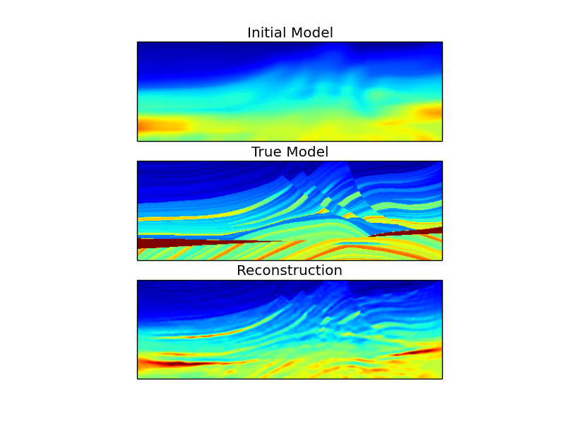
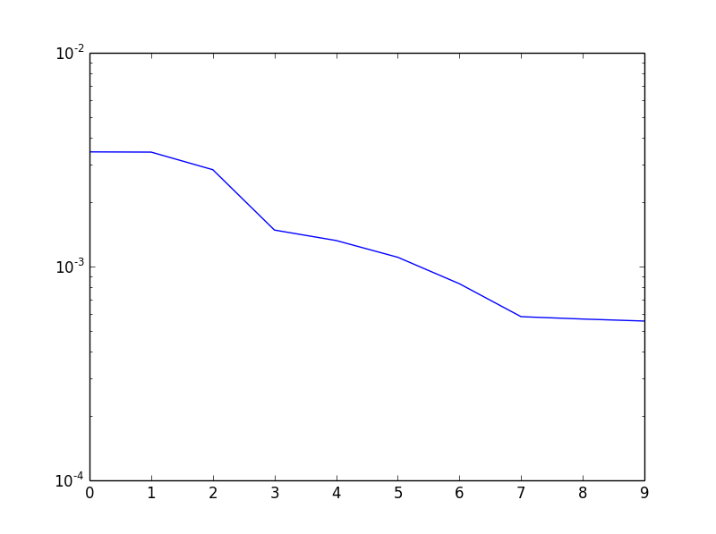

.. Licensed under a 3-clause BSD style license - see LICENSE.rst

.. warning::

    The problem in this example is designed to be run in parallel.  It can be
    run in serial, but it will be very expensive.  It is strongly recommended
    that you go through the simpler example above, first.

.. _quick_start_example_marmousi:

2D Marmousi Velocity Model
==========================

The source code for this example is in the PySIT examples directory or can be
downloaded here: :download:`ParallelMarmousi.py
<../../examples/ParallelMarmousi.py>`.

Set Up the Computing Environment
--------------------------------

Unlike the :ref:`previous example <quick_start_example>`, this demo uses
parallelism with MPI.  It *is* possible to use MPI together with IPython, but
we will use this example to introduce a way to save and load computed images.

Running the Script
------------------

The following command runs the script in parallel over ``<nprocs>`` processors:

.. code:: bash

    mpirun -n <nprocs> python ParallelMarmousi.py

Details of ParallelMarmousi.py
------------------------------

Setup the standard import block.  The :mod:`time` standard library module
provides access to date, time, and timing routines.  The :mod:`sys` standard library module
provides access to many things, in this case we will use it to write to ``stdout``.

.. literalinclude:: ../../examples/ParallelMarmousi.py
    :language: python
    :lines: 1-4

Here we import the necessary PySIT tools.  In particular, we are importing the
function interface to the :mod:`pysit.gallery.marmousi` community gallery
problem.  Additionally, we import the `~pysit.util.parallel.ParallelWrapShot`
class to tell PySIT how to handle parallelism over shots.

.. literalinclude:: ../../examples/ParallelMarmousi.py
    :language: python
    :lines: 6-9

Of course, we will also need access to MPI routines.

.. literalinclude:: ../../examples/ParallelMarmousi.py
    :language: python
    :lines: 11

The block ``if __name__ == '__main__':`` is a way to tell the Python
interpreter not to execute this code if the file is simply imported.  Here, we
are executing the script, so anytyhing inside this block *will be executed.*

For convenience, we create local references to some relevant MPI properties.

.. literalinclude:: ../../examples/ParallelMarmousi.py
    :language: python
    :lines: 13-17

This line constructs a wrapper on the ``COMM_WORLD`` MPI communicator and
essentially tells PySIT that shots will be distributed evenly over the
processors.

.. literalinclude:: ../../examples/ParallelMarmousi.py
    :language: python
    :lines: 19-20

Construct the true velocity, initial velocity, `computational mesh
<pysit.core.mesh.CartesianMesh>`, and `physical domain
<pysit.core.domain.RectangularDomain>` for a small patch of the Marmousi
velocity model.  The ``patch`` keyword tells
:func:`~pysit.gallery.marmousi.marmousi` that we will use a small, predefined
section of the full velocity model.

.. warning::

    If a patch of a community gallery model, at a particular resolution, has
    not been used before, PySIT will generate it and store it.  There
    currently exists a race condition that can cause issues if a script is
    running in parallel and the patch has not been precomputed.  It is
    recommended that you precompute this patch by:

    1. Opening an IPython console
    2. Running ``from pysit.gallery import marmousi``
    3. Running ``C, C0, m, d = marmousi(patch='mini_square')``

    This needs to be done only once.

.. literalinclude:: ../../examples/ParallelMarmousi.py
    :language: python
    :lines: 25-26

For this problem, we are using one shot per processor, so the size of the
communicator defines the number of shots for the problem.  Note that the call
to :func:`~pysit.core.acquisition.equispaced_acquisition` takes a keyword for
the parallel wrapper.  This allows the acquisition function to evenly
distribute construction of the list of shots.  The returned list of shots will
contain only the shots assigned to the current processor.

.. literalinclude:: ../../examples/ParallelMarmousi.py
    :language: python
    :lines: 30-39

As before, define the wave solver.

.. literalinclude:: ../../examples/ParallelMarmousi.py
    :language: python
    :lines: 42-47

And generate the data.  Note that the parallel wrapper is not needed here, as
each shot exists only on the processor that owns it and each piece of data can
be generated independently.

.. literalinclude:: ../../examples/ParallelMarmousi.py
    :language: python
    :lines: 51-54

An MPI Barrier allows the processors to synchronize after generating the data.

.. literalinclude:: ../../examples/ParallelMarmousi.py
    :language: python
    :lines: 58

Define the objective function.  As the objective function contains an explicit
summation over shots, we must pass the parallel wrapper to the constructor so
that the summation can occur when the objective is evaluated and gradients are
computed.

.. literalinclude:: ../../examples/ParallelMarmousi.py
    :language: python
    :lines: 65-66

Define the optimization routine and set the initial value to be the velocity
that we generated with the gallery problem.

.. literalinclude:: ../../examples/ParallelMarmousi.py
    :language: python
    :lines: 68-71

Configure and run the optimization for 10 steps, storing the reconstructed
model and the value of the objective function at every iteration.

.. literalinclude:: ../../examples/ParallelMarmousi.py
    :language: python
    :lines: 77-85

Finally, only one processor needs to save the data.  The SciPy io function
:func:`~scipy.io.savemat` will save a dictionary of numpy arrays in the MATLAB
file format.  Here, we save the reconstruction, the true model, the initial
mode, and an array of the objective values to a file called
``marm_recon.mat``.

.. literalinclude:: ../../examples/ParallelMarmousi.py
    :language: python
    :lines: 90-106

On 12 cores of a 16 core Intel Xeon E5-2670 machine, this script runs in
roughly 25 minutes.

Visualizing the Results
-----------------------

Start an IPython console with the command

.. code::

	ipython --pylab

Then, import the SciPy function :func:`~scipy.io.loadmat`.

.. code:: python

    from scipy.io import loadmat

Next, load the ``.mat`` file the script created.

.. code:: python

    result = loadmat('marm_recon.mat')

Now we can plot the three models on the same color scale.

.. code:: python

    clim = result['true'].min(), result['true'].max()

    plt.figure()

    plt.subplot(3,1,1)
    plt.imshow(result['initial'].T, clim=clim)
    plt.title('Initial Model')
    plt.xticks([])
    plt.yticks([])

    plt.subplot(3,1,2)
    plt.imshow(result['true'].T, clim=clim)
    plt.title('True Model')
    plt.xticks([])
    plt.yticks([])

    plt.subplot(3,1,3)
    plt.imshow(result['result'].T, clim=clim)
    plt.title('Reconstruction')
    plt.xticks([])
    plt.yticks([])

Finally, we can plot the behavior of the objective function.

.. code:: python

    plt.figure()
    plt.semilogy(result['obj'][0])

